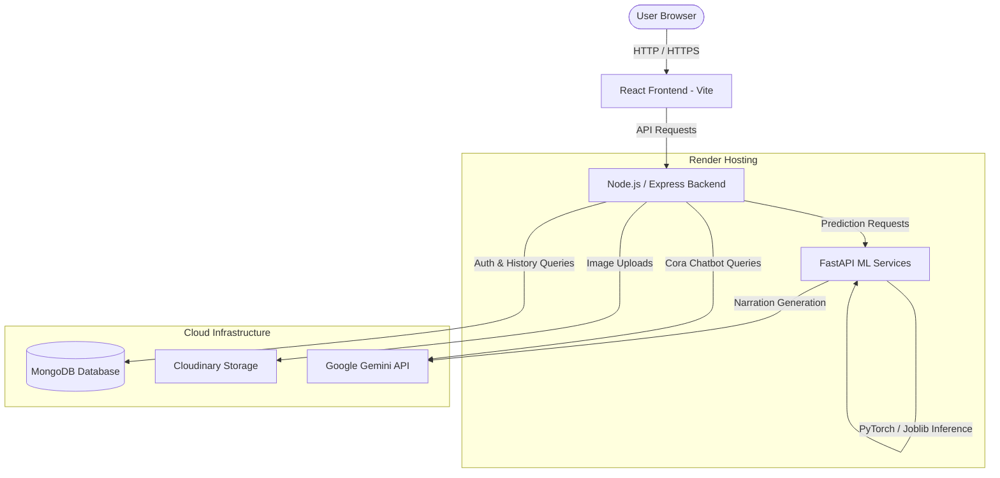

# PCOSmart - AI-Powered PCOS Screening & Lifestyle Guide

PCOSmart is a web application designed to assist in the early screening and lifestyle management of Polycystic Ovary Syndrome (PCOS). By combining machine learning tabular predictions, deep learning image classification, and explainable AI (XAI) interpretations, the platform provides users with risk assessments and personalized, hormone-balancing recommendations.

---

## 🏛️ System Architecture

PCOSmart follows a decoupled, three-tier microservice architecture:



### 1. Frontend (Vite / React)
- **Technology Stack:** React, Axios, React Router, React Icons.
- **Key Features:**
  - Dynamic multi-stage symptom questionnaires (with range checks).
  - Drag-and-drop ultrasound image upload.
  - Interactive dashboards featuring circular progress graphs, SHAP impact analysis bars, and recommendations.
  - Interactive Cora Chatbot UI.

### 2. Backend (Node.js / Express)
- **Technology Stack:** Node.js, Express, Mongoose, JSON Web Tokens (JWT), Cloudinary, Multer, PDFKit.
- **Key Features:**
  - Secure User authentication (Registration & Login) via JWT and bcrypt password hashing.
  - Proxy orchestration, converting multipart image uploads to bytes and parsing clinical JSON to feed the ML services.
  - PDF Report Generator compiling patient inputs, probabilities, contributing factors, and lifestyle guidelines.

### 3. ML Services (FastAPI / PyTorch)
- **Technology Stack:** FastAPI, PyTorch, Torchvision, Scikit-Learn, XGBoost, Joblib, SHAP, Google Generative AI SDK.
- **Supported Models:**
  - **Simple Text Model:** Scikit-Learn pipeline processing 18 basic lifestyle parameters.
  - **Clinical Text Model:** Pipeline processing lifestyle variables alongside hormone and laboratory values.
  - **Image Classifier (ResNet18):** PyTorch Deep Learning model analyzing pelvic ultrasound scans.
  - **Late Fusion Model:** Custom neural network merging ResNet18 image features with clinical laboratory vectors for a joint prediction.
  - **Explainable AI (SHAP):** Calculates Shapley values for simple and clinical inputs to pinpoint precisely which indicators increase or decrease a user's risk.
  - **Gemini Narration:** Wraps prediction outputs to generate custom health narrations.

---

## 🔑 Environment Configuration

### Backend Environment Variables (`backend/.env`)
| Variable | Description | Example / Value |
| :--- | :--- | :--- |
| `PORT` | Local port the backend listens on | `5000` |
| `MONGOURI` | MongoDB Atlas deployment connection URI | `mongodb+srv://...` |
| `JWT_SECRET` | Secret token signing JWT authorization | `PCOSmart@123` |
| `CHATBOT_API_KEY`| Google Gemini API key for Cora Chatbot | `AIzaSy...` |
| `CLOUDINARY_CLOUD_NAME` | Cloudinary name identifier | `duoognyhr` |
| `CLOUDINARY_API_KEY` | Cloudinary credential API key | `124815123126823` |
| `CLOUDINARY_API_SECRET` | Cloudinary secret credential key | `bWV8...` |
| `ML_SERVICE_URL` | Endpoint of the FastAPI ML microservice | `http://localhost:8000` |
| `FRONTEND_URL` | Allowed origin for CORS validation (optional) | `https://pcosmart.vercel.app` |

### ML Service Environment Variables (`ml_services/.env`)
| Variable | Description | Example / Value |
| :--- | :--- | :--- |
| `GEMINI_API_KEY` | Google Gemini API key for narrations | `AIzaSy...` |

---

## ⚙️ Local Development Setup

### 1. Prerequisites
- Node.js (v18 or higher)
- Python 3.11.x
- MongoDB (running locally on port `27017`)

### 2. Running the ML Services
```bash
cd ml_services
python -m venv .venv
# On Windows:
.\.venv\Scripts\activate
# On Linux/macOS:
source .venv/bin/activate

pip install -r requirements.txt
uvicorn main:app --host 0.0.0.0 --port 8000 --reload
```

### 3. Running the Backend Server
```bash
cd backend
npm install
npm run dev
```

### 4. Running the Frontend Server
```bash
cd frontend
npm install
npm run dev
```

---

## 🚀 Production Deployment

### Frontend (Vercel)
- Set the Root Directory to `frontend`.
- Set the framework preset to `Vite`.
- Add the environment variable `VITE_BACKEND_API_URL` pointing to your deployed backend (e.g. `https://pcosmart-backend.onrender.com/api`).
- *Note:* The included [vercel.json](frontend/vercel.json) automatically handles single-page routing rewrites to avoid 404 errors on page reload.

### Backend (Render)
- Deploy a new **Web Service** with the Root Directory set to `backend`.
- Build Command: `npm install`
- Start Command: `npm start`
- Configure all backend `.env` variables in Render's **Environment** tab.

### ML Services (Render)
- Deploy a new **Web Service** with the Root Directory set to `ml_services`.
- Build Command: `pip install -r requirements.txt`
- Start Command: `uvicorn main:app --host 0.0.0.0 --port $PORT`
- Configure `GEMINI_API_KEY` in Render's **Environment** tab.
